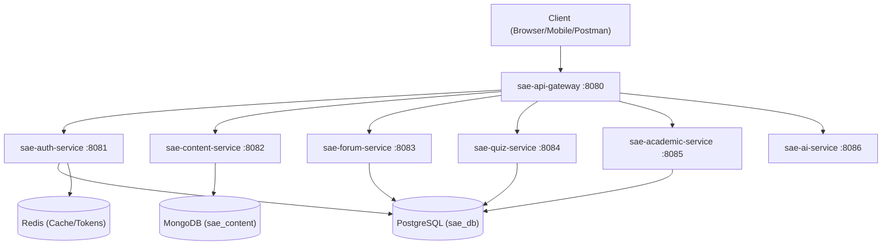

# 🚀 SmartSAE - Documentação do Projecto (API Ecosystem)

O **SmartSAE** é uma plataforma modular de apoio ao estudante baseada em uma arquitetura de **microserviços**. Este documento detalha a estrutura, a arquitetura e os passos necessários para correr o ecossistema completo.

---

## 🏗️ Arquitetura do Sistema

A arquitetura segue o padrão de microserviços desacoplados (Loose Coupling), comunicando-se através de um **API Gateway** centralizado.



### Componentes e Responsabilidades

| Módulo | Porta | Descrição do Serviço |
| :--- | :--- | :--- |
| **`sae-api-gateway`** | 8080 | Único ponto de entrada. Gerencia o roteamento e filtros (StripPrefix). |
| **`sae-common`** | - | Biblioteca compartilhada. Contém segurança (JWT), filtros, exceções e modelos comuns. |
| **`sae-auth-service`** | 8081 | Gestão de utilizadores, autenticação JWT, registo e validação via OTP. |
| **`sae-content-service`**| 8082 | Gestão de materiais de estudo. Utiliza **MongoDB** (Persitência flexível). |
| **`sae-forum-service`** | 8083 | Fóruns de discussão, perguntas e respostas. |
| **`sae-quiz-service`** | 8084 | Criação e realização de questionários e avaliações. |
| **`sae-academic-service`**| 8085 | Registos académicos completos: turmas, notas, alunos e professores. |
| **`sae-ai-service`** | 8086 | Assistente Virtual inteligente integrado para apoio directo ao estudo. |

---

## 📂 Estrutura de Directorios

```text
sae-fullstack/
├── sae-api-master/           # Raiz do projecto Maven (Parent POM)
│   ├── sae-common/           # Biblioteca Partilhada (Dependência fundamental)
│   ├── sae-api-gateway/      # Spring Cloud Gateway (Entry Point)
│   ├── sae-auth-service/     # Autenticação e Users (PostgreSQL + Redis)
│   ├── sae-content-service/  # Materiais de Estudo (MongoDB)
│   ├── sae-forum-service/    # Fórum/Comunidade (PostgreSQL)
│   ├── sae-quiz-service/     # Questionários (PostgreSQL)
│   ├── sae-academic-service/ # Gestão Académica (PostgreSQL)
│   ├── sae-ai-service/       # Inteligência Artificial
│   ├── docker-compose.yml    # Infraestrutura (Persistência)
│   └── docs/                 # Documentação PDF/MD original
```

---

## 🛠️ Como Correr o Projecto (Passo-a-Passo)

### 1. Pré-requisitos
- **Java 17** (JDK instalado e configurado no PATH)
- **Maven 3.8+**
- **Docker Compose**
- **Postman** (Para testar os endpoints)

### 2. Infraestrutura (Docker)
Inicie os contentores das bases de dados e cache:
```bash
docker-compose up -d
```
> Isso subirá: **PostgreSQL** (5432), **MongoDB** (27017) e **Redis** (6379).

### 3. Compilação Global
Compile todo o ecossistema na pasta raiz do Maven:
```bash
mvn clean install -DskipTests
```
> **IMPORTANTE:** O Microserviço de Autenticação e os outros dependem do `sae-common`. O `install` é vital para que os outros módulos o localizem no repositório local.

### 4. Execução dos Microserviços
Inicie os serviços na seguinte sequência recomendada para evitar erros de descoberta:
1. `sae-auth-service` (`mvn spring-boot:run`)
2. `sae-api-gateway` (`mvn spring-boot:run`)
3. `sae-academic-service` (e outros conforme necessário)

---

## 🔒 Segurança e Endpoints Públicos

Toda a segurança é controlada pela classe `SecurityConfig` no `sae-common`. Estão configurados como abertos por defeito:
- **Registo de Users:** `/auth/users/signup/**` (POST)
- **Login:** `/auth/users/login` (POST)
- **OTP:** `/auth/users/otpValidation/**`

> [!WARNING]
> **Strip Prefix:** O Gateway remove o prefixo da rota. 
> Exemplo: Chamar `localhost:8080/auth/users/login` -> O Gateway encaminha internamente para `localhost:8081/users/login`.

---

## 🧪 Notas de Verificação Técnica
- Se o **Auth Service** retornar 403 em rotas que deveriam ser públicas, verifique se o wildcard `/**` foi incluído na configuração de segurança centralizada.
- Certifique-se que o perfil `dev` está activo (`spring.profiles.active=dev`).
